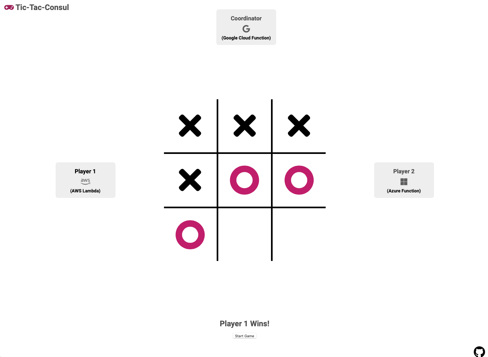

<h1 align="center">Tic-Tac-Consul</h1>

<p align="center">
    
</p>

# What is this and Why?

Tic Tac Consul pits serverless functions from GCP, AWS and Azure in an epic match of Tic Tac Toe! No, but seriously, Tic Tac Consul is focused on exploring the challenges of networking across environments and integrating serverless functions with the rest of your application stack. Specifically, how new features of Consul called Mesh Gateways, Terminating Gateways and Ingress Gateways can be combined to accomplish a few interesting ideas.

[Tic-Tac-Consul: Multi Cloud Serverless Networking Blog Post](https://medium.com/hashicorp-engineering/tic-tac-consul-multi-cloud-serverless-networking-b030111a2af3)


# Setup

Given that this is a multi-cloud demo, there is some additional setup required. Namely, we are going to need credentials for all three cloud providers and unfortunately they are all a bit different.

### AWS Credentials

We're going to be leveraging a set of AWS Access Keys and Secret Keys for authentication.

1. Generate the Access Key and Secret Key for your Terraform user

```
aws iam create-access-key --user-name terraform
```

2. Fetch your AWS Account ID

```
aws sts get-caller-identity --query Account --output text
```

3. Copy the terraform.tfvars.template file to terraform.tfvars

```
cp terraform.tfvars.template terraform.tfvars
```

4. Set the TF variables respectively in the terraform.tfvars file

```
aws_access_key="..."
aws_secret_key="..."
aws_account_id="..."
...
```

### GCP Credentials

For GCP we're going to leverage a Service Account key.

1. Generate Service Account key and save it to the credentials folder 

```
gcloud iam service-accounts keys create  --iam-account [SERVICE_ACCOUNT_EMAIL_ADDRESS_GOES_HERE] credentials/creds.json
```

2. Get your GCP Project ID

```
gcloud config get-value project
```

3. Set the TF variables respectively in the terraform.tfvars file

```
...
gcp_project_id="..."
gcp_credentials_path="credentials/creds.json"
```

4. Enable APIs

```
Compute Engine API
Serverless VPC Access API
Cloud Functions API
Cloud Build API
```

### Azure Credentials

Currently Azure credentials are based off the Azure CLI authentication method. As a result, you simply need to be authenticated with `az`

### Terraform Apply

Run Terraform Apply and let it configure the necessary resources.

```
terraform apply
```